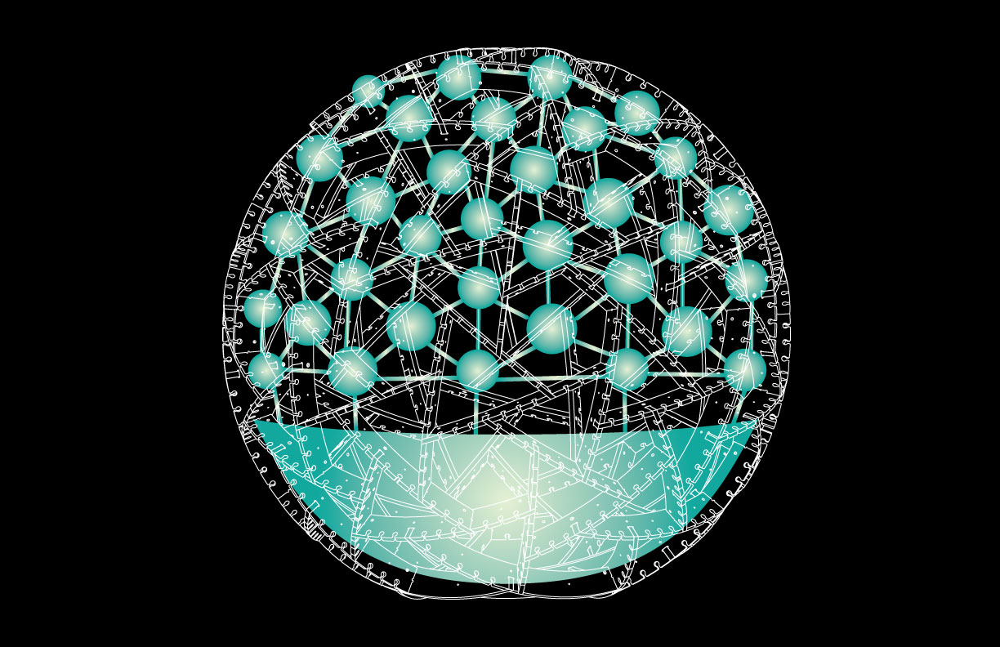

Smart Spirulina System
=================

The Smart Spirulina System was developed by Jimmy Tang and Regina Flores Mir as part of their Research Fellowship at Terreform One during the summer of 2015.

_____________________________________________

# Plug In Ecology: Urban Farm Pod

The Smart Spirulina System is a bio-informatic message system incorporated into the Urban Farm Pod part of the Plug-In Ecology framework being developed at Terreform One. The objective of this project is a system design that will show how to grow Spirulina in an urban farm setting. The system design is broken out into two areas: 

(1) A grow system for the cultivation of large amounts of Spirulina and a distribution system to allocate to Spirulina Bottles on the surface of the sphere. 

(2) A digital monitoring platform that can (a) relay specific information about the health and growing conditions of the Spirulina directly to a user's smart-phone or desktop and (b) integrate into the Internet of Plants by providing a public and free API.

